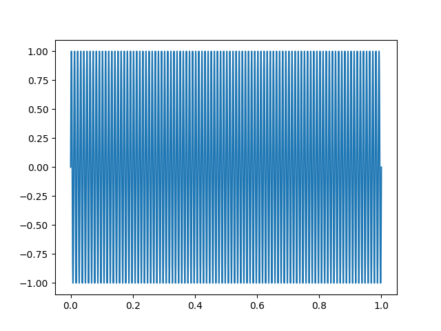
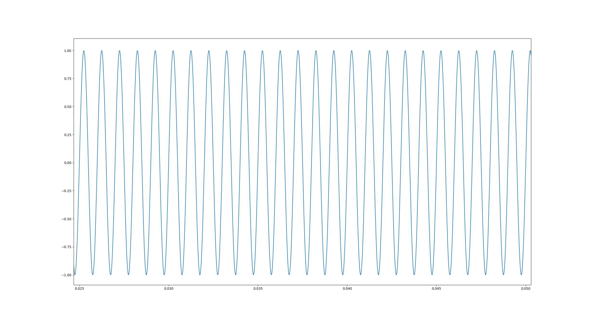
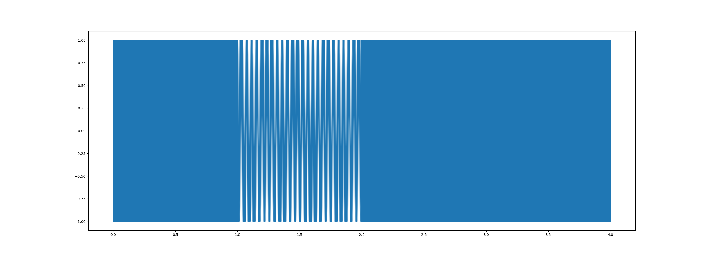
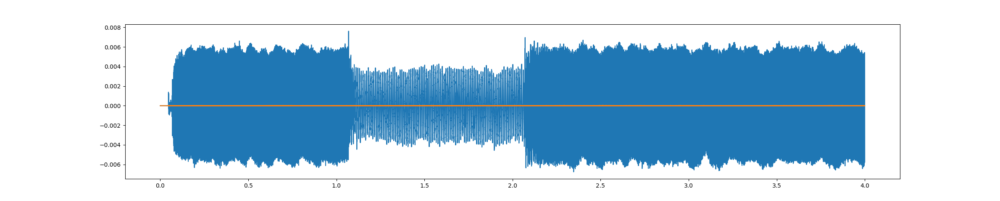
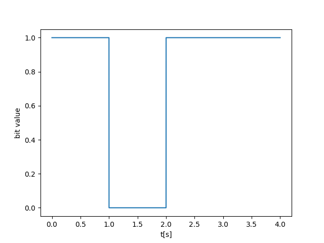

# PyDoS

PyDoS (Python Data-over-Sound) is a simple python script that simulates a modem.

## What it does and how it works?

### The "what"

This program takes an array on bit values, such as:

``` python
bits = [1, 0, 1, 1]
```

And it generates a sine wave that can be then played by the sound card. The sound produced by the speakers is then captured by the microphone, and another method converts the sound wave back into the original bit array.  
This emulates the process of converting digital data into an analog signal, sending and receiving it over an analog medium and then converting back into digital, much like a modem.

### The "how"

By taking a look at `config.py` under `src/`, we can notice some key components that help us build the sine wave:

1. `sample_rate = 44100 # [Hz]`: the sample rate of the wave
2. `bit_duration = 1 # [s]`: the time duration allocated for each bit into the output signal
3. `freq_high = 1000 # [Hz]`: the frequency of the sine-wave used to represent a `1` bit
4. `freq_low = 100 # [Hz]`: the frequency of the sine-wave used to represent a `0` bit

As such, we can deduce that the way this program builds the soundwave is by concatenating together 1 second long sine waves, of alternating frequencies in order to represent each bit.

| Bit value | Wave frequency | Waveform |
| :-: | :-: | :-: |
| 0 | 100 Hz |  |
| 1 | 1 kHz |  |

## Obstacles along the way

- Signal Interference

> Interference from background noise in the room may alter the recorded soundwave to a degree where it is virtually unusable. This can easily be observer by looking at the console output after running the program. Very rarely, if ever, we will notice the frequencies from the recorded signal to match the 100/1000 Hz we generated.

- The quality of the emitter and receiver hardware

> The quality of the signal is highly dependent on the quality of the equipment at both ends. For example, a small low-end speaker may represent the signal less accurately, and a low-end microphone will not record the signal perfectly. These imperfections may just add up enough for the recorded signal to be different enough from the generated signal that the bits may be misinterpreted.

- Distance between emitter and receiver

> The distance between the speaker and the microphone matters, i.e., the distance over which we have to send the signal is very relevant, as a higher distance requires, in this case, a higher volume set on the speakers for the microphone to reliably pick it up.

## Example

For example, assuming the already mentioned bits for input:

``` python
bits = [1, 0, 1, 1]
```
<p align="center">
  
</p>

The program will generate the following sine wave:

<p align="center">
  
</p>

We can easily observe the original bit array within our signal, since the 2 used frequencies are far apart enough for it to be noticeable.

Next, this signal is played by the sound card and recorded back via the microphone. The previous wave, recorded by a my microphone looks like this:

<p align="center">
  
</p>

We can notice quite a bit of noise and variance, but it is still easily recognizable.

Next, a the `decode` method will reconstruct the bit array by analyzing the frequencies of each section of our signal, producing the following signal:

<p align="center">
  
</p>

---

_a project by Mircea-Pavel Anton (Mike Anthony)_
